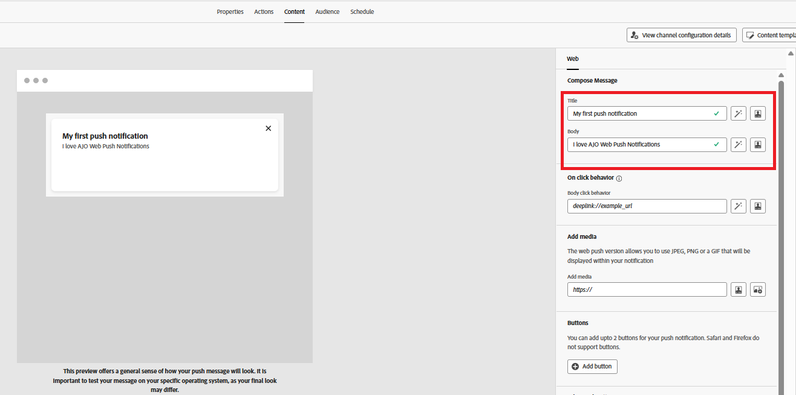

# Skapa kampanj

I det här steget skapar du en kampanj i Adobe Journey Optimizer för att skicka schemalagda push-meddelanden till användare som har valt att vara med. Kampanjen riktar sig till en berättigad målgrupp och levererar meddelanden vid en fördefinierad tidpunkt, vilket möjliggör planerat och målgruppsbaserat engagemang.

* Logga in på Journey Optimizer
* Navigera till Resehantering | Kampanjer | Skapa kampanjer

## Ange kampanjinställningar

Ange kampanjnamnet

## Associera åtgärd med kampanjen

Associera den push-kanalskonfiguration som skapades tidigare i den här självstudien

## Associera målgrupp med kampanjen

Associera målgruppen `AudienceForPush` med kampanjen

## Skapa innehåll för push-meddelanden

Skapa enkelt push-innehåll för testning av push-meddelanden. Ange rubrik och brödtext för meddelandet enligt nedan

## Schemalägg kampanjen

Schemalägg kampanjen efter era behov

Se slutligen till att du aktiverar kampanjen.

## Testa kampanjen

Om du vill testa kampanjen aktiverar du först meddelanden på [webbsidan genom att välja ](http://localhost:3000) när du uppmanas till det. När du har valt att delta väntar du tills kampanjen körs vid den schemalagda tidpunkten. När kampanjen körs bör du få push-meddelandet i webbläsaren.

