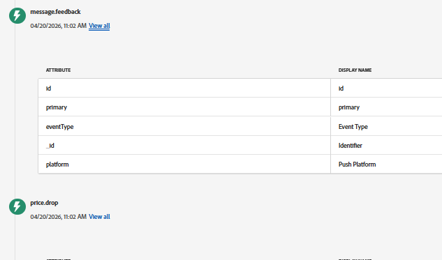

# Felsökning av webbpush i AJO

På den här sidan finns praktiska tips för att felsöka flödet för push-meddelanden på webben, bland annat för att verifiera Web SDK-begäranden, kontrollera ECID och användarprofilen i AEP samt för att se till att händelser som price.drop skickas och tas emot på rätt sätt.

- **Använd Adobe Experience Platform Debugger (Chrome Extension)**\
  Installera [AEP Debugger-tillägget för Chrome](https://chrome.google.com/webstore/detail/adobe-experience-platform/bfnnokhpnncpkdmbokanobigaccjkpob) för att enklare kontrollera Web SDK-aktiviteter:

Med det här verktyget kan du
- Visa förfrågningar och svar från SDK på webben\
- Kontrollera ECID (Experience Cloud-id)\
- Validera datastream-konfiguration och nyttolaster

- **Kontrollera om användaren identifieras (ECID)**\
  Använd AEP Debugger eller webbläsarkonsolen för att bekräfta att ett ECID genereras. Detta ID används för att spåra användare i AEP och AJO.

- **Använd fliken Nätverk för att verifiera begäranden**\
  Öppna **nätverksfliken** i webbläsarens utvecklarverktyg och filtrera efter förfrågningar från Web SDK (sök efter `/collect` eller `interact`).
   - Bekräfta att begäranden skickas när sidan läses in och när åtgärder aktiveras
   - Kontrollera att händelsen `price.drop` ingår i nyttolasten

- **Slå upp användarprofilen i AEP**\
  Använd ECID för att söka efter användarens profil i Adobe Experience Platform. Detta bekräftar att användaren känns igen och att deras data (som push-prenumerationer) lagras på rätt sätt.

- **Verifiera att `price.drop`-händelsen har tagits emot**\
  När du har utlöst händelsen från webbsidan ska du kontrollera i AEP om händelsen har importerats och kopplats till samma ECID.
Kontrollera json för händelsen message.feedback för `feedback.status`. Statusvärdet ska vara `sent`
  

- **Bekräfta att push-meddelanden är aktiverade**\
  Kontrollera att:
   - Användaren accepterade webbläsarmeddelandet
   - Det finns en push-token i användarens profil

- **Kontrollera resekonfigurationen**\
  Kontrollera att resan har publicerats och konfigurerats för att lyssna på `price.drop`-händelsen.

