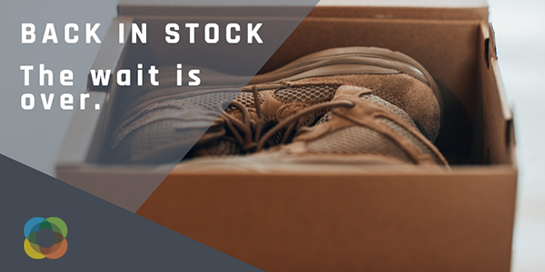

# Journey Optimizer-utmaningar - introduktion och krav

Utmaningarna är ett scenario och de krav som krävs för att öva det du lärt dig. Utmaningarna hjälper er att utvärdera era färdigheter och identifiera kunskapsluckor.

Varje utmaning i det här avsnittet åtgärdar ett unikt användningsfall som du ska implementera. Målgruppen (persona) och de kunskaper som krävs listas i början av varje utmaning.

## Förutsättningar

### Systemkrav

* Tillgång till en Journey Optimizer-sandlåda - vi rekommenderar att du slutför utmaningen i en dedikerad utbildningssandlåda.
* AEM Assets Essentials måste etableras för din instans
* E-postkanalen måste konfigureras för transaktions- och marknadsföringsmeddelanden

### Åtkomsträttigheter

Du behöver följande åtkomsträttigheter:
* *Resechef* eller *Reseadministratör*
* Visa testprofiler och deras attribut

>[!NOTE]
> Utövningarna utvecklades utifrån Lumas exempeldata. Vi rekommenderar att du konfigurerar en utbildningshandlåda som är konfigurerad med exempeldata. Gå till självstudiekursen [Konfigurera en utbildningssandlåda](/help/tutorial-configure-a-training-sandbox/introduction-and-prerequisites.md) för instruktioner för detaljerade instruktioner.

### Nödvändiga åtgärder

* Om du inte har använt Adobe Journey Optimizer tidigare ska du slutföra kursen [Komma igång med Journey Optimizer för resechefer och administratörer](https://experienceleague.adobe.com/?recommended=JourneyOptimizer-U-1-2021.1).

## The Story

Luma är ett fiktivt designföretag, med butiker i flera länder, en online-närvaro med en webbplats och mobilappar. Luma använder Adobe Journey Optimizer för att leverera sammankopplade, kontextuella och personaliserade upplevelser till sina kunder.

Luma vill marknadsföra sina senaste kläder och kugghjulsinsamling och öka försäljningen för befintliga kunder. Ni har anlitats för att implementera Lumas marknadsförings- och lojalitetskampanjer i Journey Optimizer.

## Dina utmaningar

<table>
<tr>
<td>
 

      
      

  </td>
  <td>
   <a href="summer-collection-announcement-challenge.md">
    <strong>Skapa ett sommarsamlingsmeddelande </strong>
    </a>
      

      <em>Främja nya Luma sommar-samlingen. </em>
      

      <b>Nödvändiga färdigheter:</b>
      <li><a href="https://experienceleague.adobe.com/docs/journey-optimizer-learn/tutorials/profiles-segments-subscriptions/create-segments.html"> Skapa segment</li>
      <li><a href="https://experienceleague.adobe.com/docs/journey-optimizer-learn/tutorials/create-messages/create-emails/import-and-author-html-email-content.html">Importera och redigera e-postinnehåll från HTML</li>
      <li><a href="https://experienceleague.adobe.com/docs/journey-optimizer-learn/tutorials/create-journeys/use-case-read-segment.html">Användningsfall - Lässegment</li>
  </td>
  </tr>
  <tr>
  <td>
  

    
  </td>
  <td>
      <a href="order-confirmation-challenge.md">
    <strong>Skapa en orderbekräftelse</strong>
    </a>
    

    

    <em>Skicka en orderbekräftelse via e-post när någon har slutfört ett onlineköp
    </em>
    

  </td>
  </tr>
  <tr>
    <td>
    

    
    

    <td>
    

      <a href="product-replenishment-challenge.md">
    <strong>Skapa ett meddelande om produktpåfyllnad </strong>
    </a>
    

    

    <em>Meddela kunderna när en artikel som inte finns i lager är tillbaka</em>
    

  </td>
  </tr>
  <tr>
    <td>
    

    
    

    <td>
    

      <a href="loyalty-status-welcome-email-challenge.md">
    <strong>Skapa ett välkomstmeddelande om lojalitetsstatus </strong>
    </a>
    

    

    <em>Skicka ett e-postmeddelande när en lojalitetskund flyttar till en ny nivå för att gratulera och informera dem om deras nya fördelar</em>
    

  </td>
  </tr>
</table>
