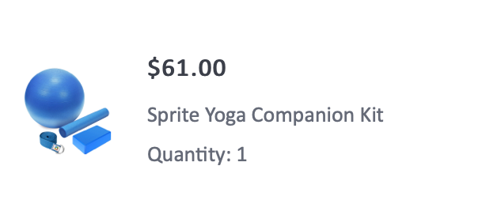

# Skapa ett e-postmeddelande med orderbekräftelse

| Utmaning | Skapa en orderbekräftelsetransaktion via e-post |
|---|---|
| Persona | Resechef |
| Nödvändiga färdigheter | <ul><li>[Skapa e-postinnehåll med meddelanderedigeraren](https://experienceleague.adobe.com/docs/journey-optimizer-learn/tutorials/email-channel/create-content-with-the-email-designer.html?lang=sv-SE)</li> <li>[Använd sammanhangsbaserad händelseinformation för personalisering](https://experienceleague.adobe.com/docs/journey-optimizer-learn/tutorials/personalize-content/use-contextual-event-information-for-personalization.html?lang=sv-SE)</li><li>[Använd hjälpfunktioner för personalisering](https://experienceleague.adobe.com/docs/journey-optimizer-learn/tutorials/personalize-content/use-helper-functions-for-personalization.html?lang=sv-SE)</li></ul> |
| Assets att ladda ned | [Beställa bekräftelseresurser](/help/challenges/assets/email-assets/order-confirmation-assets.zip) |

{style="table-layout:auto"}

## Artikeln

Luma lanserar sin webbutik och vill säkerställa en bra kundupplevelse. De skickar en orderbekräftelse via e-post när kunden har lagt en order.

## Utmaningen

Skapa en resa som skickar ett e-postmeddelande med en orderbekräftelse när en Luma-kund slutför en onlinebeställning.

>[!BEGINTABS]

>[!TAB Uppgift]

1. Skapa en resa med namnet `Luma - Order Confirmation`.

1. Använd händelsen: `LumaOnlinePurchase`.

1. Skapa ett **transaktionellt**-e-postmeddelande med namnet `Luma - Order Confirmation`.

   * Ämnesraden&quot;Tack för ditt köp, `FirstName`&quot;

   * Använd mallen `Luma - Order summary` och ändra den:

      * Ta bort `You may also like`-avsnitten

      * Lägg till länken för att avbryta prenumerationen längst ned i e-postmeddelandet

E-postmeddelandet ska struktureras på följande sätt:

<table>
<tr>
<td>
  <div>
     <strong> Sidhuvudsavsnittet </strong>
      </div>
  </td>
  <td>
      <p>
     <li>luma_logo.png</li>
    <li>Den ska länka till lumas webbplats: https://luma.enablementadobe.com/content/luma/us/en.html</li>
    <p>
    </td>
  </tr>
  <tr>
  <td>
  <div>
    <strong>Bekräftelsesektion för beställning
    </strong>
  </td>
  <td>
    <p>
    <strong>Text</strong><p>
    <em>Hej {firstName},</em><p>
   <div>
    <p>
     <em>Din beställning har lagts.
    <p>När ditt paket har skickats skickar vi ett e-postmeddelande med ett spårningsnummer så att du kan spåra din beställning.</p></em>
    </strong>
    </tr>
  </td>
 <td>
  <div>
     <strong> Leverera till sektion</strong>
      </div>
      <p>
      <li>Förnamn och efternamn kommer från profilen
      <li>Ersätt den hårdkodade adressen i mallen med <b>leveransadressen</b>
      <li>Adressinformationen är sammanhangsberoende attribut från evenemanget (gata 1, ort, postnummer, delstat)
      <li> Ta bort <i>rabatt, summa, ankomst</i></p>
  </td>
  <td>
  <p> Leverera till:</p>
      <em>{firstName} {lastName}<br>
     {Street 1}<br>
     {City}, {State} {postalCode}<br></em></p>
  </td>
 <tr>
<td>
  <div>
     <strong>Avsnittet med beställningsinformation</strong>
      </div>
       <p><li>Lägg till det här avsnittet under avsnittet <b>Leverera till</b>.
      </p><br>
      <p><b>Tips:</b>
      <li>Använd strukturkomponenten <b>1:2 kolumn till vänster</b> för det här avsnittet
      <li>Det här är sammanhangsbaserad händelseinformation.
      <li>Använd hjälpfunktionen : [!UICONTROL each]
      <li>Växla till kodredigeringsformatet för att lägga till kontextdata.
  </td>
  <td>
    <strong>Sidhuvud</strong>
    <p>
  Ordning: <em>{purchaseOrderNumber}</em>
    </p>
    <strong>Lista över beställda produkter:
  </strong>
  <p>Visa en lista över varje produkt i beställningen med en bild, pris och namn.
  <p>Layouten för varje objekt ska se ut så här:
    
<p><b>Lägg till länken i kundvagnen</b>
<p>Ersätt order-ID i URL:en med inköpsordernummer:
   <i>https://luma.enablementadobe.com/content/luma/us/en/user/account/order-history/order-details.html?orderId=90845952-c2ea-4872-8466-5289183e4607</i>
</td>
  </tr>
</table>

>[!TIP]
>
>För att du ska kunna felsöka dina resor är det bästa sättet att lägga till en alternativ sökväg till alla meddelandeåtgärder om det finns en tidsgräns eller ett fel.

>[!TAB Slutförandevillkor]

Trigga den resa du skapade i testläge och skicka e-postmeddelandet till dig själv:

1. Innan du växlar till testläge åsidosätter du e-postparametrarna som ska skickas till testmeddelandet till din e-postadress:
   1. Öppna vyn för e-postinformation.
   1. Klicka på T-symbolen (aktivera åsidosättning av parameter) i avsnittet E-postparametrar
   1. Klicka i adressfältet
   1. På nästa skärm lägger du till din e-postadress inom parentes: *&quot;yourname@yourdomain&quot;* i uttrycksredigeraren och klickar på OK.
1. Testa resan
1. Utlös händelsen med följande parametrar:
   * Ange profilidentifieraren till: Identitetsvärde:`a8f14eab3b483c2b96171b575ecd90b1`
   * Händelsetyp: commerce.purchase
   * `Quantity`: 1
   * `Price Total:` 69
   * `Purchase Order Number:` 90845952-c2ea-4872-8466-5289183e4607
   * `SKU:` LLMH09
   * `City:`San Jose
   * `Postal Code:` 95119
   * `State`: CA
   * `Street:` 245 Park Avenue

Du bör få en personlig inköpsbekräftelse via e-post.

* Ämnesraden ska ha testprofilens förnamn: Leora

* Så här ska din e-postbrödtext se ut:


>[!TAB Kontrollera ditt arbete]

**Resa**


**E-post**

**Ämnesrad:**

Tack för ditt köp, `{{ profile.person.name.firstName }}`!

**Leverera till sektion:**

Så här ska koden se ut:

```javascript
{{ profile.person.name.firstName }} {{ profile.person.name.lastName }}
{{context.journey.events.454181416.commerce.shipping.address.street1}}
{{context.journey.events.454181416.commerce.shipping.address.city}}, {{context.journey.events.454181416.commerce.shipping.address.state}} {{context.journey.events.454181416.commerce.shipping.address.postalCode}}
```

*event.45481416* är ett annat nummer för dig.

TIPS: Anpassa varje rad separat

**Avsnittet Orderinformation:**

Så här ska koden se ut:

Sidhuvud:

```javascript
Order #: {{context.journey.events.1627840522.commerce.order.purchaseOrderNumber}}
```

**Produktlista:**

Använd hjälpfunktionen &quot;each&quot; för att skapa produktlistan. Visa dem i en tabell. Så här ska din kod se ut (med dina specifika variabler som ditt händelse-ID - i stället för `454181416` och din organisations-ID i stället för `techmarketingdemos` ):

```javascript
{{#each context.journey.events.454181416.productListItems as |product|}}<tr> <th class="colspan33"><div class="acr-fragment acr-component image-container" data-component-id="image" style="width:100%;text-align:center;" contenteditable="false"><!--[if mso]><table cellpadding="0" cellspacing="0" border="0" width="100%"><tr><td style="text-align: center;" ><![endif]--><!--[if mso]></td></tr></table><![endif]--></div></th> <th class="colspan66"><div class="acr-fragment acr-component" data-component-id="text" contenteditable="false"><div class="text-container" contenteditable="true"><p><span style="font-weight:700;">{{context.journey.events.454181416.productListItems.VYG__902489191a0a40e67f51f17f3ea9e2dfaf2dea3bd0bebe8b._techmarketingdemos.product.name}}</span></p></div></div><div class="acr-fragment acr-component" data-component-id="text" contenteditable="false"><div class="text-container" contenteditable="true"><p>${{context.journey.events.454181416.productListItems.VYG__902489191a0a40e67f51f17f3ea9e2dfaf2dea3bd0bebe8b._techmarketingdemos.product.price}}.00</p></div></div></th></tr> {{/each}}
```

**Knappen Visa ordning:**

`https://luma.enablementadobe.com/content/luma/us/en/user/account/order-history/order-details.html?orderId={{context.journey.events.454181416.commerce.order.purchaseOrderNumber}}`

**Prissumma:**

Totalt:`${{context.journey.events.1627840522.commerce.order.priceTotal}}.00`


>[!ENDTABS]