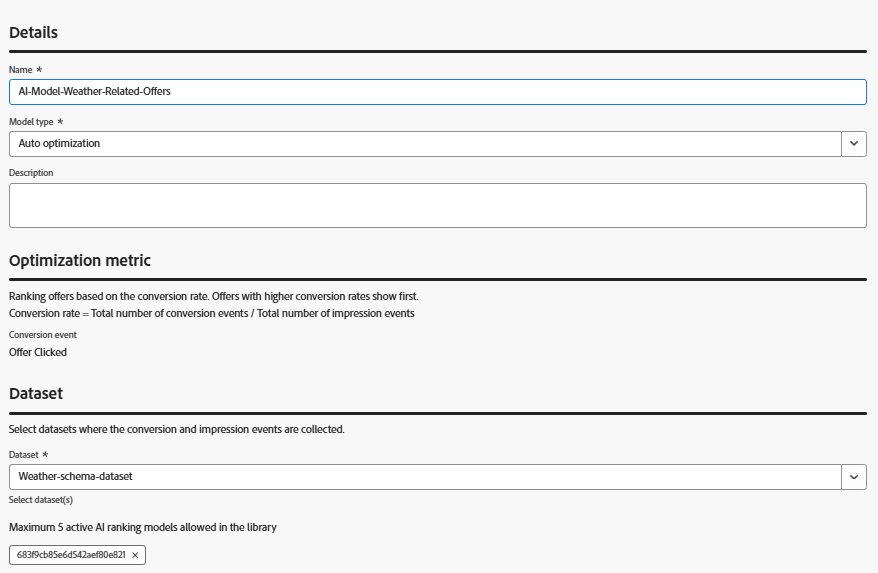

# Samla in erbjudandeinteraktioner med Adobe Web SDK for AI Model Training

>[!NOTE]
>
> Fyll i den här artikeln endast om du tänker använda AI-baserade rankningsmetoder i Adobe Journey Optimizer för att anpassa vilket erbjudande som visas baserat på förväntat engagemang.


I den här artikeln beskrivs hur du fångar upp interaktionshändelser (som visningar eller klickningar) med hjälp av Adobe Experience Platform Web SDK genom att anropa alloy(&quot;sendEvent&quot;, ...) direkt i JavaScript-koden. Data hämtas in i AEP och används för att utbilda AI-modeller i Adobe Journey Optimizer (AJO) för smartare rangordning av erbjudanden baserat på beteenden i realtid.

Om du vill skapa en AI-modell för rangordning av erbjudanden i Adobe Journey Optimizer, måste din datamängd baseras på ett schema som innehåller fältgruppen för förslagsinteraktioner. Den här fältgruppen har stöd för tangentbeslutshändelser som decisioning.propositionDisplay och decisioning.propositionInteract, tillsammans med obligatoriska fält som includedPropositions, display och interact.

Det finns två giltiga metoder för att uppnå detta:

- Skapa ett nytt schema, en ny datamängd och en ny datastream som är specifikt konfigurerad för interaktionsspårning
- Uppdatera ett befintligt schema - vilket är vad du gör i den här självstudien


## Uppdatera befintligt schema för att hämta offertinteraktionshändelser

I stället för att skapa ett nytt schema uppdateras det befintliga Experience Event-schema som används för väderrelaterade erbjudanden för att stödja interaktionsspårning.

I Adobe Experience Platform:

- Öppna det befintliga _&#x200B;**Weather-Schema**&#x200B;_ Experience Event-schemat som du använder för väderbaserade erbjudanden.

- Lägg till fältgruppen:
Experience Event - Proposition Interactions

Du behöver inte skapa en ny datauppsättning eller ett nytt dataflöde - fortsätt använda din befintliga inställning för vädererbjudanden. Evenemangen är anpassade efter Adobe Journey Optimizer förväntningar på utbildning i AI-modeller och uppföljning av erbjudanden.


Fortsätt använda den aktuella datauppsättningen (du behöver inte skapa en ny)

Den befintliga dataströmmen är redan konfigurerad och används i egenskapen Adobe Experience Platform Tags - inga ändringar behövs där.

SDK skickar automatiskt nya interaktionshändelser till rätt mål.

Denna smidiga konfiguration säkerställer att alla beslut- och väderhändelser samlas i en enda, enhetlig datauppsättning, vilket är idealiskt för utbildning av AI-modeller i Adobe Journey Optimizer.


## Fånga erbjudandevisningshändelser (tryck)

Erbjudandets HTML-struktur har ändrats så att den innehåller interaktiva element - närmare bestämt `<a>` - och `<button>` -taggar - som gör att användare kan utnyttja erbjudandet (till exempel knapparna&quot;Anspråkserbjudande&quot; eller&quot;Läs mer&quot;).

Varje knapp innehåller ett data-offer-id-attribut så att motsvarande interaktion kan spåras korrekt.


För att logga när erbjudanden visas för användarna har den befintliga JavaScript-filen som används för att rendera vädererbjudanden uppdaterats så att den omfattar spårning av visningshändelser.

En decisioning.propositionDisplay-händelse skickas nu med Adobe Web SDK (alloy.sendEvent) när ett eller flera erbjudanden visas. Den här händelsen innehåller den obligatoriska visningen: 1-flagga och refererar till de aktuella förslagen.


```javascript
if (offerIds.length > 0) {
  alloy("sendEvent", {
    xdm: {
      _id: generateUUID(),
      timestamp: new Date().toISOString(),
      eventType: "decisioning.propositionDisplay",
      _experience: {
        decisioning: {
          propositionEvent: {
            display: 1
          },
          involvedPropositions: offerIds.map(id => ({
            id,
            scope: "web://gbedekar489.github.io/weather/weather-offers.html#offerContainer"
          }))
        }
      }
    }
  });
}
```

## Fånga erbjudandeklickningshändelser (interaktioner)

För att spåra när en användare klickar på ett erbjudande har vi uppdaterat den befintliga JavaScript så att den lyssnar efter klick på både `<a>` och `<button>` element som återges i erbjudandebehållaren.

När en klickning upptäcks skickas en Decision.propositionInteract-händelse med Adobe Web SDK. Händelsen innehåller den nödvändiga interaktionen: 1-flaggan och refererar till det specifika erbjudande-ID:t och beslutsomfånget.

```javascript
// Attach click tracking to <a> and <button> elements
wrapper.querySelectorAll("a, button").forEach(el => {
  el.addEventListener("click", () => {
    const offerId = el.getAttribute("data-offer-id") || item.id;
    console.log("Clicked element offerId:", offerId);

    alloy("sendEvent", {
      xdm: {
        _id: generateUUID(),
        timestamp: new Date().toISOString(),
        eventType: "decisioning.propositionInteract",
        _experience: {
          decisioning: {
            propositionEvent: {
              interact: 1
            },
            involvedPropositions: [{
              id: offerId,
              scope: "web://gbedekar489.github.io/weather/weather-offers.html#offerContainer"
            }]
          }
        }
      }
    });
  });
});
```

## Skapa en AI-modell för rankning av erbjudanden i Adobe Journey Optimizer Offer Decisioning

Med, erbjudanden och klickningar som nu samlats in via Web SDK och lagrats i Adobe Experience Platform, kan dessa data användas för att utbilda en AI-modell som förutser vilka erbjudanden som är mest benägna att öka engagemanget.

Den här AI-modellen refereras i en rankningsformel eller en urvalsstrategi för att avgöra vilka erbjudanden som prioriteras för varje användare.
- Logga in på Journey Optimizer
- Navigera till Beslut -> Strategisk konfiguration -> AI-modeller ->Skapa AI-modell
- Se till att använda rätt datauppsättning
  
- Spara och aktivera AI-modellen.
- Uppdatera urvalsstrategin som skapades i det tidigare steget så att AI-modellen används för rangordningsmetoden
  

## Testa lösningen

Inkludera den [uppdaterade JavaScript-filen](assets/ai-model.js) på den [befintliga webbsidan](assets/weather-offers.html)