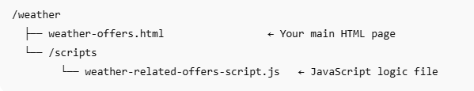

# Testa lösningen

Om du vill testa lösningen från början till slut måste filerna [west-offers.html](assets/weather-offers.html) och [western-offers-script.js](assets/weather-related-offers-script.js) finnas på en webbserver eller en offentlig värdtjänst som Github Pages. Detta är nödvändigt eftersom:
- Webbläsarens geolocation-API fungerar bara över HTTPS eller localhost

För att hålla ordning på saker och se till att relativa sökvägar fungerar som de ska rekommenderar vi följande mappstruktur som värd för lösningen:



## Ladda ned de medföljande filerna

[HTML-fil](assets/weather-offers.html)

[JavaScript-fil](assets/weather-related-offers-script.js)


## Uppdatera yt-URL:en i javascript-filen

Öppna `weather-related-offers-script.js` och uppdatera ` "web://yourdomain.com/weather/weather-offers.html#offerContainer"`bt-ersättaren `yourdomain.com` med den domän där HTML-filen finns.

## Uppdatera egenskapen Adobe Experience Platform Tags

Öppna filen west-offers.html i textredigeraren och ersätt script-taggen med script-taggen för den Adobe Experience Platform Tag-egenskap som skapades i det tidigare steget i den här självstudien. Spara filen

```
<script src="https://assets.adobedtm.com/AEM_TAGS/launch-ENabcd1234.min.js" async></script>
```


## Vad webbsidan gör

En webbsida är byggd för att testa kontextuell personalisering av erbjudanden med hjälp av temperaturdata i realtid. När en användare besöker sidan uppmanas han/hon att ange platsåtkomst. Vid godkännande hämtar sidan aktuella väderdetaljer, som temperatur, tillstånd och ort, via API:t OpenWeatherMap. Sammanhangsberoende data visas för användaren och skickas till Adobe Experience Platform med Adobe Web SDK (Alloy).

Anropet sendEvent har konfigurerats med renderDecision: false, vilket innebär att erbjudanden som returneras av Adobe Journey Optimizer hanteras manuellt. Skriptet behandlar beslutssvaret, avkodar innehållet och infogar dynamiskt det mest relevanta erbjudandet i en angiven behållare (#offerContainer).

## Vad JavaScript gör

JavaScript hämtar dynamiskt väderinformation utifrån användarens plats och använder Adobe Experience Platform (AEP) för att leverera personaliserade erbjudanden. Här följer en beskrivning av stegen:

1. **Väntar på att allokering ska läsas in**

   Skriptet ser till att Adobe Web SDK (Alloy) är fullständigt inläst innan du gör några personaliseringsbegäranden.

2. **Hämtar användarens plats**

   Det använder webbläsarens Geolocation-API för att hämta användarens aktuella latitud och longitud.

3. **Hämtar väderdata**

   API:t OpenWeatherMap anropas för att få aktuell väderinformation:

   Temperatur (i °F)

   Vädervillkor (till exempel &quot;Regn&quot;, &quot;Rensa&quot;)

   Ortsnamn

   Luftfuktighet

4. **Visa väderinformation på webbsidan**

   Uppdaterar DOM med ett meddelande som:

   &quot;Aktuell temperatur i San Diego är 72°F med klar himmel.&quot;

5. **Skickar väderkontext till AEP**

   Använder alloy(&quot;sendEvent&quot;) för att skicka sammanhangsberoende väderdata till AEP

   ```javascript
   xdm: {
   eventType: "decisioning.request",
   _techmarketingdemos: {
   temperature: temp,
   weatherConditions: condition,
   cityName: city
     }
   }
   ```

6. **Hämtar och återger erbjudanden**

   Tar emot erbjudanden som returnerats av AJO Decisioning.

   Avkodar HTML-innehåll.

   Lägg in erbjudandena i <div id="offerContainer"> -element.

## Nästa steg

[Mät och rapportera effekten av AJO Decisioning.](https://experienceleague.adobe.com/en/docs/journey-optimizer-learn/reporting-on-ajo-od/introduction)

