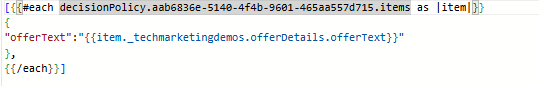

# Leverera Personalization med JSON-innehåll i Adobe Journey Optimizer

Det här avsnittet tillhandahålls som en extra resurs för avancerade användare som vill ha större kontroll över hur erbjudanden återges på frontend.

Om du använder JSON-innehållstypen i en kodbaserad upplevelse (CBE) kan du returnera strukturerade erbjudandedata och hantera återgivningen dynamiskt med JavaScript. JSON-innehållstypen är särskilt användbar för scenarier som kräver anpassade layouter, villkorlig logik eller integrering med sammanhangsberoende data, till exempel väder, plats eller enhetstyp.

Detta är inte nödvändigt för grundläggande leverans av erbjudanden, men erbjuder flexibilitet för utvecklare att skapa personaliserade, datadrivna upplevelser utöver vad som är möjligt med HTML standardrendering.

## Skapa en kodbaserad upplevelse (CBE) med JSON-innehållstyp.

Börja med att skapa en ny kodbaserad upplevelse (CBE) i Adobe Journey Optimizer och ställ in Content Format på JSON. Innehållstypen anger för AJO att returnera strukturerade erbjudandedata (som offerText, bilder eller metadata) som ett JSON-objekt i stället för att rendera HTML. Definiera plattformen (till exempel webben), mål-URL:en där erbjudandet finns och platsen på sidan (till exempel ett behållar-ID som offerContainer). Med den här konfigurationen kan webbprogrammet ta emot erbjudandedata och dynamiskt återge dem med JavaScript.


## Associera CBE med en kampanj med en beslutspolicy

När den kodbaserade upplevelsen (CBE) med JSON-innehållstypen har skapats länkas den till en kampanj via en beslutspolicy. I beslutspolicyn definieras logiken för behörighet, rankning och leverans baserat på profil- eller kontextuella data.

När du infogar beslutsprincipen i Personalization Editor (t.ex. för meddelanden i appen eller e-post) är det viktigt att se till att utdata har en giltig JSON-struktur.

När du infogar en beslutspolicy i Personalization Editor (PE) i en kampanj genererar Adobe Journey Optimizer automatiskt en Handlebars-slinga baserat på den valda policyn. Till exempel:

Den här slingan itererar igenom alla beslutsobjekt som returneras av principen och injicerar fältet offerText från varje erbjudande. Den här standardstrukturen fungerar bra för HTML-innehållstyper, men när du arbetar med JSON-innehåll kan det krävas en omstrukturering för att skapa en giltig JSON-array eller -objekt, särskilt om resultatet tolkas programmatiskt.



Denna Handlebars-mall är utformad för att generera en JSON-matris med objekt, där varje objekt innehåller ett enda offerText-fält. Den gör en slinga genom de beslutsobjekt som returneras av den angivna beslutsprincipen och kapslar in alla offerText i ett JSON-objektformat.

## Tolka JSON-erbjudandesvar

Svaret från AJO innehåller anpassade beslutsobjekt i JSON-format under strukturen `propositions[].items[].data.content[]`. Varje innehållsobjekt innehåller fält som offerText.

```javascript
(response.propositions || []).forEach(p => {
  (p.items || []).forEach(item => {
    const contents = item.data?.content || [];
    contents.forEach(contentItem => {
      const html = contentItem.offerText || "";
      const wrapper = document.createElement("div");
      wrapper.className = "offer";
      wrapper.innerHTML = html;
      document.getElementById("offerContainer").appendChild(wrapper);
    });
  });
});
```

### Exempelresurser

Ladda ned HTML-exempelfilen och JavaScript-filen som visar hur man använder JSON-baserade erbjudanden och återger dem dynamiskt på webbsidan.

[JavaScript-kod](assets/weather-related-offers-script-multiple-json.js)
[HTML-fil &#x200B;](assets/multiple-json.html)