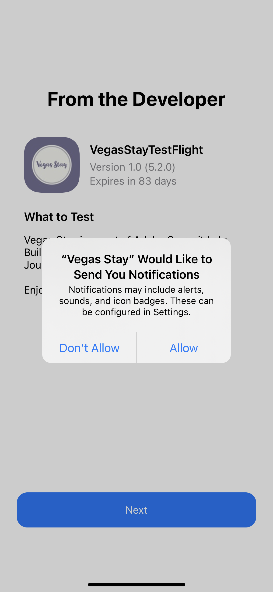

# Summit Lab L731 - Cheat Sheet

Den här sidan innehåller text och länkar som används i L731 Summit Lab. Du kan kopiera och klistra in innehållet i dina Journey Optimizer-meddelanden.

## Utgång 1.1 - Hämta och installera appen

Skanna QR-koden för att hämta appen

>[!BEGINTABS]

>[!TAB iOS]

Du ombeds installera Testflight (steg 1 till 4). När du har installerat Testflight följer du steg 5-8 för att installera Vegas Keep App:

<table>
<tr>
</tr>
<tr>
<td>
 

      

      <b>Steg 1 </b>
      

      
      

  </td>
  <td>
 

      

      <b>Steg 2 </b>
      

      
      

  </td>
  <td>
 

      

      <b>Steg 3 </b>
      

      
      

  </td>
  <td>
 

      

      <b>Steg 4 </b>
      

      
      

  </td>
  </tr>
  <tr>
<td>
 

      

      <b>Steg 5 </b>
      

      
      

  </td>
  <td>
 

      

      <b>Steg 6 </b>
      

      
      

  </td>
  <td>
 

      

      <b>Steg 7 </b>
      

      
      

  </td>
  <td>
 

      

      <b>Steg 8 </b>
      

      
      

  </td>
  </tr>
</table>

>[!TAB Android]

Använd den här länken om du använder Android-simulatorn: [https://ajolab.s3.amazonaws.com/ajolabapp-release.apk](https://ajolab.s3.amazonaws.com/ajolabapp-release.apk)

Eftersom appen inte är registrerad i Google Play Store får du ett varningsmeddelande:

Klicka **Installera ändå**

>[!ENDTABS]

## Utövning 1.3: Logga in på Adobe Journey Optimizer

[Klicka här för att logga in på Journey Optimizer](https://experience.adobe.com/#/@techmarketingdemos/sname:summit-2023-ajo-lab/journey-optimizer/home)

**Inloggningsinformation:**

* **Användarnamn:** `L731+<your seat number>@summitlab.us` (exempel: L731+001@summitlab.us)
* **Lösenord:** Adobe2023!

## Exercise 2.1 Skapa en kampanj i appen

| Fält | Text | Länkar |
|----|----|----|
| Kampanjnamn | `<your seat number> March Vegas Campaign` |  |
| Matcher | känga |  |
| Alternativet Media URL |  | https://mcfadyen.com/wp-content/uploads/2023/01/Adobe-Summit-2023-Banner.png |
| Titel | Det är Händelse och det är Live! |  |
| Brödtext | Adobe Summit återvänder till Las Vegas 21-23 mars 2023. Gör dig redo för inspirerande talare, spännande sessioner och nya kontakter. |  |
| Knapp | Boka hotell nu och spara 10 % | lab://booking?suite=presidential&amp;discount=10 |
| Knapp: Interaktiv händelse | CTA i appen |  |
| Bas-URL |  | iOS: lab://  Android&amp;: https://lab |

## Lektion 3 Skapa en flerkanalig resa

**Reseetikett:**
`<your seat number>` - Välkomstresa

>[!BEGINTABS]

>[!TAB Push-meddelande]

**Etikett:**
Välkomstmeddelande

**Titel:**\
Välkommen till Vegas!

**Brödtext:**\
Hoppa över raden och checka in med mobilappen

**Deeplink:** lab://checkin

**Media:**

https://experienceleague.adobe.com/docs/journey-optimizer-learn/assets/vegas_online_check_in.jpg?lang=en

Det här är bilden som vi använder för push-meddelandet:

>[!TAB SMS-meddelande]

**Etikett:**
Välkomstmeddelande

**Meddelande:**
Välkommen till Vegas. Hoppa över raden och checka in med mobilappen: lab://checkin

>[!TAB E-postmeddelande]

**Etikett:**
Bekräftelsemeddelande

**Ämnesrad:**
{{profile.person.name.firstName}}, du är incheckad, kolla in våra erbjudanden för din vistelse!

>[!ENDTABS]
