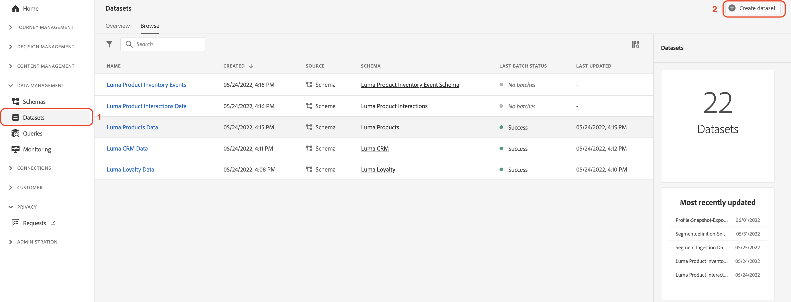
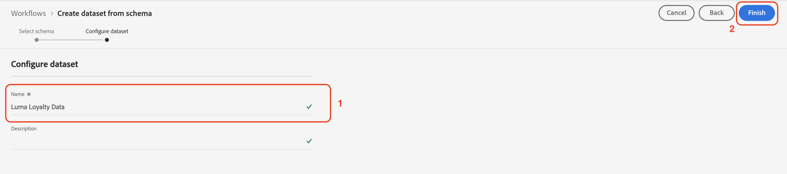

# Infoga data manuellt

I det här avsnittet får du hjälp med att skapa datauppsättningar och importera exempeldata.

>[!TIP]
>
> Se videosjälvstudiekursen [Skapa datauppsättningar och importera data](/help/set-up-data/create-datasets-and-ingest-data.md) innan du börjar.

Du skapar fem [!UICONTROL datauppsättningar] baserat på Luma [!UICONTROL scheman] du skapade i [föregående avsnitt](/help/tutorial-configure-a-training-sandbox/manual-data-set-up.md). När datauppsättningarna har skapats kan du importera data från JSON-filerna som du hämtade och ändrade. (Se [Introduktion och krav](/help/tutorial-configure-a-training-sandbox/introduction-and-prerequisites.md) för instruktioner).

## Skapa den första datauppsättningen

Skapa en datauppsättning med namnet *[!DNL Luma Loyalty Data]* från [!DNL Luma Loyalty schema]

1. Från vänster navigering, under [!UICONTROL DATAHANTERING], markera **[!UICONTROL Datauppsättningar]**.

1. Välj **[!UICONTROL Skapa datauppsättning]**.

   

1. På nästa sida väljer du [!UICONTROL Skapa datauppsättning från schema].

   

1. På nästa sida söker du efter *[!DNL Luma Loyalty]* schema som du skapade tidigare.

1. Välj *[!DNL Luma Loyalty]*.

1. Klicka på **[!UICONTROL Nästa]**.

   

1. Konfigurera datauppsättningen:

   * Namn: `Luma Loyalty Data`

1. Klicka **[!UICONTROL Slutför]**.

   

## Samplingsdata

När du har skapat en datauppsättning kan du importera data till datauppsättningen.

1. På [!DNL Luma Loyalty Data] bläddra nedåt i den högra panelen till [!UICONTROL LÄGG TILL DATA] och aktivera:

   * **[!UICONTROL Feldiagnostik]** och

   * **[!UICONTROL Delvis intag]**

   

1. Dra och släpp `luma-loyalty.json` -fil för att överföra exempeldata till datauppsättningen.

1. Uppdatera sidan och kontrollera batchstatusen för att bekräfta att filen har importerats korrekt.

   375 poster borde ha importerats. Det kan ta några minuter innan data har importerats.

>[!TIP]
>
>Om batchen misslyckas kontrollerar du att du har ersatt organisations-ID:t i `luma-loyalty.json` med [organisations-ID](https://experienceleague.adobe.com/docs/core-services/interface/administration/organizations.html?lang=sv).

## Skapa ytterligare fem [!UICONTROL datauppsättningar]

Skapa sedan följande fem ytterligare [!UICONTROL datauppsättningar] och lägga in data i `Luma CRM Data`, `Luma Products Data`och `Luma Test Profiles` datauppsättningar.

| Namn på datauppsättning | Från schema | Fil att importera | Poster |
| -----| ------ | -------| ------- |
| `Luma CRM Data` | `Luma CRM` | `luma-crm.json` | 500 |
| `Luma Products Data` | `Luma Products` | `luma-products.json` | 92 |
| `Luma Product Interactions Data` | `Luma Product Interactions` | ingen | 0 |
| `Luma Product Inventory Events` | `Luma Product Inventory Events` | ingen | 0 |
| `Luma Test Profiles` | `Luma Test Profiles` | `luma-test-profiles.json` | 3 |

## Nästa steg

Du har skapat alla nödvändiga datauppsättningar och importerat exempeldata. Det sista steget är att [konfigurera händelser](/help/tutorial-configure-a-training-sandbox/configure-events.md).
