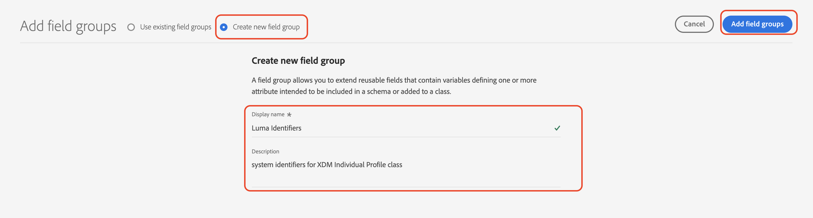
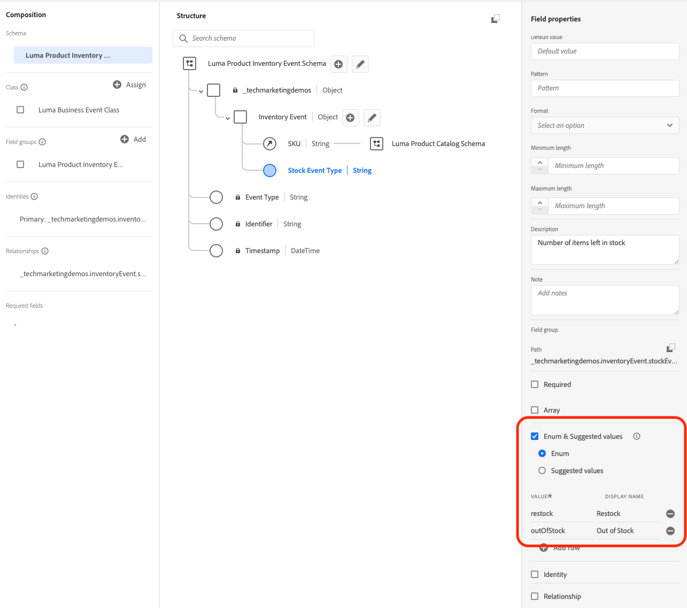

# Konfigurera data manuellt

I det här avsnittet skapar du de identitetsnamnutrymmen som krävs och definierar [!DNL Luma] exempeldatastrukturen genom att skapa [[!UICONTROL scheman]](https://experienceleague.adobe.com/docs/experience-platform/xdm/schema/composition.html).

>[!TIP]
>Se videosjälvstudiekursen [Mappa identiteter](/help/set-up-data/map-identities.md) innan du börjar.

## Steg 1: Skapa ID-namnutrymmen

I det här steget skapar du identitetsnamnutrymmen för [!DNL Luma] anpassade identitetsfält namngivna `lumaLoyaltyId`, `lumaCrmId`och `lumaProductSKU`. Identitetsnamnutrymmen spelar en viktig roll när det gäller att skapa kundprofiler i realtid, eftersom två matchande värden i samma namnutrymme gör att två datakällor kan bilda ett identitetsdiagram.

Börja med att skapa en [!UICONTROL namespace] för [!DNL Luma Loyalty ID] schema:

1. Gå till * i Journey Optimizer användargränssnitt **[!UICONTROL Kund]** > **[!UICONTROL Identiteter]** i den vänstra navigeringen.

1. Välj **[!UICONTROL Skapa namnutrymme för identitet]**.

1. Ange följande information:

   | Visningsnamn | Identitetssymbol | Typ |
   |---|---|---|
   | `Luma Loyalty ID` | `lumaLoyaltyId` | [!UICONTROL Enhetsoberoende ID] |

1. Välj **[!UICONTROL Skapa]**.

   

1. Skapa ytterligare två namnutrymmen enligt samma steg:

   | Visningsnamn | Identitetssymbol | Typ |
   |---|---|---|
   | `Luma CRM ID` | `lumaCrmId` | [!UICONTROL Enhetsoberoende ID] |
   | `Luma Product SKU` | `lumaProductSKU` | [!UICONTROL Identifierare för icke-personer] |

## Steg 2: Skapa scheman

I det här steget definierar du strukturen för exempeldata genom att skapa sex [[!UICONTROL scheman]](https://experienceleague.adobe.com/docs/experience-platform/xdm/schema/composition.html):

* [[!DNL Luma Loyalty Schema]](#create-luma-loyalty-schema)

* [[!DNL Luma Product catalog Schema]](-catalog)

* [[!DNL Luma Product Inventory Events]](#create-luma-product-inventory-event-schema)

* [[!DNL Luma CRM Schema]](#create-luma-crm-and-luma-product-interactions-schemas)

* [[!DNL Luma Web Events Schema]](#create-luma-crm-and-luma-product-interactions-schemas)

* [[!DNL Luma Test Profiles Schema]](#create-luma-crm-and-luma-product-interactions-schemas)

>[!TIP]
>
>Se videosjälvstudiekursen: [Skapa ett schema](/help/set-up-data/create-schema.md) innan du börjar.

### Skapa [!DNL Luma Loyalty] [!UICONTROL Schema] {#create-luma-loyalty-schema}

#### Skapa schemat

Börja med att skapa [!DNL Luma Loyalty] schema:

1. Gå till **[!UICONTROL DATAHANTERING]** > **[!UICONTROL Scheman]** i den vänstra navigeringen.

1. Välj **[!UICONTROL Skapa schema]** överst till höger.

1. Välj **[!UICONTROL Individuell XDM-profil]** eftersom du skapar modellattribut för en enskild kund (poäng, status osv.).

   

#### Lägg till befintliga fältgrupper

Därefter uppmanas du att lägga till fältgrupper i schemat. Du måste lägga till alla fält i scheman med hjälp av grupper. Du lägger till befintliga fältgrupper och måste skapa en fältgrupp.

>[!NOTE]
>
>Om [!UICONTROL Fältgrupper] modal öppnas inte automatiskt på [!UICONTROL Scheman] sida, markera **[!UICONTROL Lägg till]** (vilket visas i följande bild).

1. På **[!UICONTROL Lägg till fältgrupper]** aktiverar du följande fältgrupper:

   * **[!UICONTROL Demografiska detaljer]** för grundläggande kunddata som namn och födelsedatum.

   * **[!UICONTROL Kontaktinformation, privat]** för grundläggande kontaktinformation som e-postadress och telefonnummer.

   * **[!UICONTROL Förmånsinformation]** för information om lojalitet som poäng, sammanfogat datum eller status. Fältgruppen för lojalitet ligger långt ned i listan, så det är enklast att söka efter den.

1. Välj **[!UICONTROL Lägg till fältgrupp]** om du vill lägga till alla tre fältgrupper i schemat.

   

1. Markera schemats översta nod.

1. Retur `Luma Loyalty Schema` som [!UICONTROL Visningsnamn].

#### Skapa en [!UICONTROL fältgrupp]

Adobe rekommenderar att du hanterar alla systemidentifierare i en och samma grupp för att säkerställa konsekvens i alla scheman:

1. Från **[!UICONTROL Disposition]** avsnitt under [!UICONTROL Fältgrupper], markera **[!UICONTROL Lägg till]**.

1. Välj **[!UICONTROL Skapa ny fältgrupp]**.

1. Lägg till `Luma Identity Profile Field Group` som **[!UICONTROL Visningsnamn]**.

1. Lägg till `system identifiers for XDM Individual Profile class` som **[!UICONTROL Beskrivning]**.

1. Välj **[!UICONTROL Lägg till fältgrupper]**.

   

#### Lägg till fält i nya [!UICONTROL fältgrupp]

Den nya, tomma fältgruppen läggs till i ditt schema. Med +-knapparna kan du lägga till nya fält på valfri plats i hierarkin. I det här fallet måste du lägga till fält på rotnivån:

1. Välj **[!UICONTROL +]** bredvid schemats namn.

   Det här steget lägger till ett fält under **ditt klient-ID** för att hantera konflikter mellan anpassade fält och standardfält.

1. I **[!UICONTROL Fältegenskaper]** sidofältet, lägg till information om det nya fältet:

   * **Fältnamn:** `systemIdentifier`

   * **[!UICONTROL Visningsnamn]:** `System Identifier`

   * **Typ:** Objekt

   * **[!UICONTROL Tilldela fältgrupp]:** [!DNL Luma identifiers]

1. Välj **[!UICONTROL Använd]**.

   

   Lägg till två fält under `systemIdentifier` objekt:

   | [!UICONTROL Fieldname] | [!UICONTROL Visningsnamn] | [!UICONTROL Typ] |
   |-------------|-----------|----------|
   | `loyaltyId` | `Loyalty ID` | [!UICONTROL Sträng] |
   | `crmId` | `CRM Id` | [!UICONTROL Sträng] |

#### Ange identiteter

Nu har du [!UICONTROL namespace] och [!DNL Luma Loyalty schema] konfigurerad. Innan du kan importera data måste du etikettera identitetsfälten. Varje schema som används med [!UICONTROL Kundprofil i realtid] måste ha en primär identitet angiven och varje inskickad post måste ha ett värde för det fältet.

1. Ange **primär identitet**:

   Från **[!DNL Luma Loyalty Schema]**:

   1. Markera **[!DNL Luma Identity Profile Field Group]**.

   2. Välj **[!DNL loyaltyId]** fält.

   3. I **[!UICONTROL Fältegenskaper]**, aktivera **[!UICONTROL Identitet]** box.

   4. Aktivera **[!UICONTROL Primär identitet]** box.

   5. Välj `Luma Loyalty Id` namnutrymme från **[!UICONTROL Identitetsnamnutrymmen]** listruta.

   6. Välj **[!UICONTROL Använd]**.

      

2. Ange en **sekundär identitet**:

   Från **[!DNL Luma Loyalty Schema]**:

   1. Markera **[!DNL Luma Identity Profile Field Group]**..

   2. Välj `crmId` fält.

   3. I **[!UICONTROL Fältegenskaper]**, aktivera **[!UICONTROL Identitet]** box.

   4. Välj `Luma CRM Id` namnutrymme från **[!UICONTROL Identitetsnamnutrymmen]** listruta.

   5. Välj **[!UICONTROL Använd]**.

#### Aktivera för profil och spara schemat

1. Markera schemats översta nod.

1. I [!UICONTROL Fältegenskaper] enable **[!UICONTROL Profil]**.

   Schemat bör se ut så här:

   

1. Välj **[!UICONTROL Spara]**.

### Skapa [!DNL Luma Product catalog Schema] {#create-luma-product-catalog-schema}

1. Gå till [!UICONTROL DATAHANTERING] -> **[!UICONTROL Scheman]** i den vänstra navigeringen.

1. Välj **[!UICONTROL Skapa schema]** överst till höger.

1. Välj **[!UICONTROL Bläddra bland alla schematyper]**, som gör att du kan skapa en klass.

1. Välj **[!UICONTROL Skapa ny klass].

1. Lägg till visningsnamnet: `Luma Product Catalog Class`.

1. Tilldela klass.

1. Skapa en [!UICONTROL fältgrupp]:

   * Visningsnamn: `Luma Product Catalog Field Group`

1. Lägg till följande fält i **[!DNL Luma Product Catalog Field Group]**.

   * Fältnamn: `product`

   * Visningsnamn: `Product`

   * Typ: [!UICONTROL Objekt]

   * Fältgrupp: [!DNL Luma Product Catalog Field Group]

1. Välj **[!UICONTROL Använd]**.

1. Lägg till följande fält i **[!DNL Product]** objekt:

   | [!UICONTROL Fieldname] | [!UICONTROL Visningsnamn] | [!UICONTROL Typ] |
   |-------------|-----------|----------|
   | `sku` | `SKU` | [!UICONTROL Sträng] |
   | `name` | `Name` | [!UICONTROL Sträng] |
   | `category` | `Category` | [!UICONTROL Sträng] |
   | `color` | `Color` | [!UICONTROL Sträng] |
   | `size` | `Size` | [!UICONTROL Sträng] |
   | `price` | `Price` | [!UICONTROL Dubbel] |
   | `description` | `Description` | [!UICONTROL Sträng] |
   | `ImageURL` | `Image URL` | [!UICONTROL Sträng] |
   | `stockQuantity` | `Stock Quantity` | [!UICONTROL Sträng] |

1. Lägg till **[!UICONTROL Visningsnamn]** `Luma Product Catalog Field Group` till [!UICONTROL fältgrupp].

1. Välj **[!UICONTROL Spara]**.

### Skapa [!DNL Luma Product Inventory Event Schema] {#create-luma-product-inventory-event-schema}

1. Gå till **[!UICONTROL DATAHANTERING]** -> **[!UICONTROL Scheman]** i den vänstra navigeringen.

1. Välj **[!UICONTROL Skapa schema]** överst till höger.

1. Välj **[!UICONTROL Bläddra bland alla schematyper]**.

1. Välj **[!UICONTROL Skapa ny klass]**.

1. Lägg till visningsnamnet: `Luma Business Event`.

1. Välj typ: *[!UICONTROL Tidsserie]*.

1. Tilldela klass.

1. Skapa en [!UICONTROL fältgrupp]:

   * Visningsnamn: `Product Inventory Event Details`

1. Lägg till **[!UICONTROL Visningsnamn]** `Luma Product Inventory Event Schema` till schemat.

1. Lägg till följande fält i fältgruppen Luma-produktinformation:

   * Fältnamn: `inventoryEvent`

   * Visningsnamn: `Inventory Event`

   * Typ: [!UICONTROL Objekt]

   * Fältgrupp: [!DNL Product Inventory Event Details]

1. Lägg till följande fält i **[!DNL Product Inventory Event Details]** objekt:

   | [!UICONTROL Fieldname] | [!UICONTROL Visningsnamn] | [!UICONTROL Typ] |
   |-------------|-----------|----------|
   | `productId` | `Product ID` | [!UICONTROL Sträng] |
   | `sku` | `SKU` | [!UICONTROL Sträng] |
   | `stockEventType` | `Stock Event Type` | **[!UICONTROL Enum]** med `restock` och `outOfStock` som värden |

   1. för att ange `stockEventType` till Enum, välj typ: `string`.

   1. Bläddra nedåt till nederkanten av **[!UICONTROL Fältegenskaper]**.

   1. Aktivera **[!UICONTROL Enum]**.

   1. Retur **[!UICONTROL values] ([!UICONTROL etikett)]**: `restock` (`restock`).

   1. Välj **[!UICONTROL Lägg till rad]**.

   1. Retur **[!UICONTROL values] ([!UICONTROL etikett)]**: `outOfStock` (`out of stock`).

   1. Välj **[!UICONTROL Använd]**.

      

1. Ange `productId` fält som **[!UICONTROL primär identitet]** använda **[!DNL Luma Product namespace]**.

1. Välj `sku` fält och definiera en relation till `product.sku` i **[!DNL Luma Product catalog Schema]** Schema:

   1. Bläddra nedåt till nederkanten av **[!UICONTROL Fältegenskaper]**.

   1. Aktivera **[!UICONTROL Relation]**.

      1. **[!UICONTROL Referensschema]**: [!DNL Luma Product catalog Schema].

      1. **[!UICONTROL Namnutrymme för referensidentitet]**: [!DNL Luma Product].
   1. Välj **[!UICONTROL Använd]**.

      Schemat bör se ut så här:

      

1. Aktivera för **Profil**.

1. Välj [!UICONTROL Spara] för att spara schemat.

### Skapa [!DNL Luma CRM] och [!DNL Luma Product Interactions] scheman {#create-luma-crm-and-luma-product-interactions-schemas}

Skapa följande ytterligare [!UICONTROL scheman]:

| [!UICONTROL Visningsnamn] | [!DNL Luma CRM] | [!DNL Luma Product Interactions] | [!DNL Luma Test Profiles] |
|  ---| ------- | ---- |----|
| **[!UICONTROL Typ]** | [!UICONTROL Individuell XDM-profil] | [!UICONTROL XDM Experience Event] | [!UICONTROL Individuell XDM-profil] |
| **[!UICONTROL Lägg till befintlig fältgrupp]** | Lumaidentifierare Demografiska detaljer Kontaktinformation, privat | Identitetskarta Handelsinformation | Lumaidentifierare Demografiska detaljer Kontaktinformation, privat Profiltestdetaljer |
| **[!UICONTROL Relation]** |  | *[!DNL productListItems.SKU]*:  Referensschema *[!DNL Luma Product catalog Schema]*  [!DNL Reference identity namespace] *[!DNL Luma Product]* schema |
| **[!UICONTROL Primär identitet] [!UICONTROL namespace])** | systemIdentifier.crmId (Luma CRM-ID) |  | personalEmail.address (Email) |
| **[!UICONTROL Sekundär identitet] [!UICONTROL namespace]** | personalEmail.address (Email) mobilePhone.number (Phone) |  |
| **[!UICONTROL Aktivera för profil]** | ja | ja | ja |

## Nästa steg

Nu när du har skapat datastrukturen [skapa datauppsättningar och importera exempeldata](/help/tutorial-configure-a-training-sandbox/manual-data-ingestion.md).
