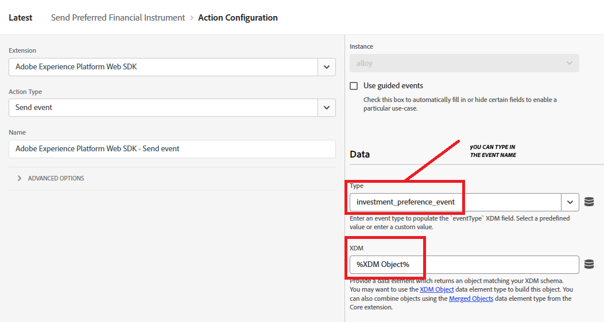

# Skapa AEP-taggar

Adobe Experience Platform Tags (tidigare Adobe Launch) hjälper er att hantera och driftsätta* marknadsförings- och analystekniker på er webbplats utan att behöva ändra webbplatsens kod.

I den här [videon beskrivs processen att skapa Adobe Experience Tags](https://experienceleague.adobe.com/sv/playlists/experience-platform-get-started-with-tags)

* Logga in i datainsamling
* Klicka på Taggar -> Ny egenskap
* Skapa en Adobe Experience Platform-tagg som kallas finansiella rådgivare.

* Lägg till följande tillägg i taggen
  

* Se till att konfigurera Adobe Experience Platform Web SDK så att rätt miljö och DataStream för finansiella rådgivare som skapades i det tidigare steget används.
  

* Ingen ytterligare konfiguration krävs för Adobe Client Data Layer och Core Extensions

## Skapa dataelement

Data Elements används för att samla in, ordna och leverera data över webbaserad marknadsföring och annonseringsteknik.

Skapa följande dataelement

| Elementnamn | Tillägg | Dataelementtyp | Ytterligare kommentarer |
|------------------------------|-----------------------------------|-------------------|------------------------------------------------------------------------------------------------------------------------------------------------------------------|
| PreferredFinancialInstrument | Core | Egen kod | Se anteckningen nedan |
| XDM-objekt | Webb-SDK för Adobe Experience Platform | XDM-objekt | Välj miljö och schema för ekonomiska rådgivare |


Öppna kodredigeraren för den anpassade koden och kopiera och klistra in följande kod

```javascript
return window.adobeDataLayer
  ?.slice()
  .reverse()
  .find(event => event.event === "assetClassSelection")
  ?.xdm?.FinancialInterest?.PreferredFinancialInstrument || "undefined";
```

## Kodförklaring

Titta på arrayen adobeDataLayer (som lagrar händelser på din webbsida).

Skapa en kopia av arrayen med .slice() så att originalet inte ändras.

Invertera ordningen för händelserna för att kontrollera de senaste händelserna först.

Hitta den första händelsen (med början från den senaste) där event.event är exakt &quot;assetClassSelection&quot;.

Om det hittas går du till händelsens xdm-data och hämtar värdet från FinancialInterest.PreferredFinancialInstrument.

Om inget hittas returnerar du strängen &quot;undefined,&quot;


## Skapa regel

Med regelbyggaren i Adobe Experience Platform Tags kan du definiera när och hur specifika åtgärder ska köras på webbplatsen baserat på användarbeteende eller händelser.

* Skapa en regel med namnet Skicka önskat finansiellt instrument. Den här regeln innehåller en händelse och en åtgärd


* Skapa en händelsekonfiguration med namnet Preferred Asset Class Selected enligt nedan. Den här händelsen lyssnar på assetClassSelection-händelser.
  


* Skapa en åtgärd för att skicka det uppdaterade XDM-schemat till AEP
  

* Den sista regeln ska se ut så här
  

## Skapa och distribuera AEP-taggar


Skapa ett nytt bibliotek och lägg till alla ändrade resurser till det, vilket visas i skärmbilderna nedan.

Lägg till bibliotek


Skapa ett bibliotek

Ange biblioteksnamnet och miljön på skärmen Skapa bibliotek.
Du måste lägga till alla ändrade resurser i det här biblioteket


Klicka sedan på knappen Spara och bygg till utveckling för att skapa biblioteket

## Inkludera AEP-taggar på HTML-sidan

När du publicerar en AEP Tags-egenskap ger Adobe dig en script-tagg som du måste placera i din HTML ``` <head>``` eller längst ned i ``` <body>``` -taggarna.

* Gå till egenskapen Tags (Financial Advisors).

* Klicka på Miljöer och klicka på installationsikonen för den miljö du vill ha (till exempel Utveckling, Förproduktion, Produktion).

* Notera den inbäddade koden. Det behövs i ett senare skede av den här självstudiekursen.
