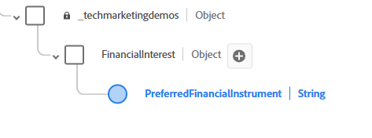

# Konfigurera XDM-schema, datauppsättning och dataström i AEP

## Skapa XDM-schema

* Logga in på Adobe Experience Platform
* Datahantering -> Scheman -> Skapa schema

* Skapa ett XDM-händelsebaserat schema med namnet _Finansiella rådgivare_. Om du inte är van vid att skapa ett schema följer du den här [dokumentationen](https://experienceleague.adobe.com/en/docs/experience-platform/xdm/tutorials/create-schema-ui)

* Lägg till följande struktur i ditt schema. Elementet PreferredFinancialInstrument lagrar användarens inställning för Stocks, Bonds, CD. **__techmarketingdemos_**är klient-ID:t och kommer att vara annorlunda i din miljö.
  

* Elementet PreferredFinancialInstrument har uppräkningsvärden som anges nedan
  

* Kontrollera att schemat är aktiverat för profilen.

## Skapa en datauppsättning baserad på schemat

En **datauppsättning i Adobe Experience Platform (AEP)** är en strukturerad lagringsbehållare som används för att importera, lagra och aktivera data baserat på ett definierat XDM-schema.

* Datahantering -> Datauppsättningar -> Skapa datauppsättning
* Skapa en datauppsättning med namnet _Datamängd för ekonomiska rådgivare_ baserat på XDM-schemat (ekonomiska rådgivare) som skapades i föregående steg.

* Kontrollera att datauppsättningen är aktiverad för profilen

## Skapa ett datastream

En datastam i Adobe Experience Platform är som en säker pipeline (eller huvudväg) som kopplar din webbplats eller app till Adobes tjänster, så att data kan flöda in och personaliserat innehåll flöda tillbaka.

* Datainsamling > Datastreams och klicka sedan på New Datastream. Namnge datastream _Financial Advisors DataStream_

* Ange följande information som visas på skärmbilden nedan
  
* Klicka på Spara, klicka sedan på Lägg till mappning och lägg till Adobe Experience Platform-tjänsten och händelsedatauppsättningen så som visas
  

* Välj lämplig händelsedatamängd (skapades tidigare).

* Spara datastream

