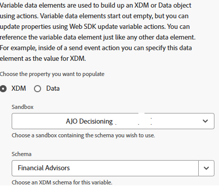

# Skicka CRMID till Adobe Experience Platform

Adobe Launch (taggar) används för att skicka CRMID till Adobe Experience Platform (AEP) eftersom det är en flexibel, händelsestyrd mekanism för överföring av identitetsdata direkt från webbläsaren. Genom att skicka CRMID efter användarinloggning kan AEP länka det anonyma ECID:t till den kända CRM-profilen, vilket möjliggör korrekt identitetssammanfogning. Denna länk utgör grunden för att skapa enhetliga kundprofiler, kvalificerade målgrupper och leverera personaliserade upplevelser i realtid i Adobe Journey Optimizer (AJO).

En AEP Tags-egenskap med namnet FinWise skapas. Följande tillägg har lagts till i taggegenskapen

Konfigurera AEP Web SDK-tillägget med hjälp av DataStream för finansiella rådgivare som skapades i den tidigare kursen.
Experience Cloud ID-tjänsten är ett valfritt tillägg som läggs till i taggegenskapen i felsökningssyfte.

## Tagga dataelement

Skapa följande dataelement

| Dataelement | Tillägg | Dataelementtyp | Anpassade inställningar |
|--------------|-----------------------------------|---------------------------|----------------------------------------|
| krut | Adobe Client Data Layer | Datalagrets beräknade läge | user.crmid |
| ECID | Experience Cloud ID-tjänst | ECID |                                        |
| identity | Webb-SDK för Adobe Experience Platform | Identitetskarta |  |
| XDMVariable | Webb-SDK för Adobe Experience Platform | Variabel |  |

## Skapa regel

Skapa en regel med namnet userLoggin med följande händelse och åtgärder

Händelse

Uppdatera variabelåtgärd

Skicka händelseåtgärd

## Spara och bygg

Spara ändringarna, skapa och bygg biblioteket.

