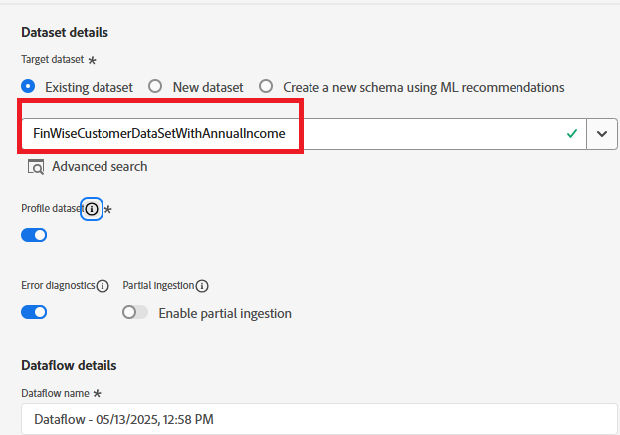

# Importera CRM-exempeldata till datauppsättningen för AEP-profiler

Importera CRM-profildata till en datauppsättning som är kopplad till ett profilaktiverat schema i Adobe Experience Platform för att börja matcha identiteter

## Skapa ett anpassat namnutrymme

* Navigera till Customer -> Identities -> Create identity namespace
* Välj Individuellt ID för olika enheter och ange visningsnamnet och identitetssymbolen så som visas på skärmbilden nedan.
  

## Skapa ett profilaktiverat schema

Skapa ett enskilt profilschema med namnet **_FinWiseProfileSchema_**. Inkludera fält, till exempel annualIncome, email, firstName, lastName och loyaltyStatus.
Lägg till ett identitetsfält **_crmid_** under SystemIdentifier-objektet. Markera det skarpa fältet som identitet och primär

## Förbered exempeldata

| crmId | firstName | lastName | e-post | loyaltyStatus | annualIncome |
|--------|-----------|----------|---------------------------|---------------|--------------|
| FIN001 | Alice | Wong | alice.wong@example.com | Guld | 336104 |
| FIN002 | Brian | Smith | brian.smith@example.com | Silver | 191065 |
| FIN003 | Cathy | Johnson | cathy.johnson@example.com | Bronze | 117015 |
| FIN004 | David | Lee | david.lee@example.com | Bronze | 61869 |
| FIN005 | Eva | Martinez | eva.martinez@example.com | Silver | 191371 |
| FIN006 | Frank | Brun | frank.brown@example.com | Silver | 196132 |
| FIN007 | Grace | Kim | grace.kim@example.com | Guld | 309851 |
| FIN008 | Henry | Davis | henry.davis@example.com | Guld | 318378 |
| FIN009 | Isla | Clark | isla.clark@example.com | Silver | 181776 |
| FIN010 | Jack | Lopez | jack.lopez@example.com | Silver | 186643 |

## Infoga CSV-filen

* Skapa en datauppsättning med namnet **_FinWiseCustomerDataSetWithAnnualIncome_** baserat på det **_FinWiseProfileSchema_** som skapades i det tidigare steget

* Navigera till Anslutningar -> Källor -> Lokalt system
* Välj **_Lägg till data_** under den lokala filöverföringen. Se till att välja _&#x200B;**FinWiseCustomerDataSetWithAnnualIncome**&#x200B;_ som måldatamängd.
  
* Gå till nästa skärm. Överför [csv-filen](assets/sample_crm_data.csv) och verifiera mappningarna
  

* Klicka på Slutför för att starta dataöverföringsprocessen

## Verifiera profil

* Navigera till Customer ->Profiles och sök efter FinWise CRM ID som är lika med FIN001 eller något annat giltigt värde
  
