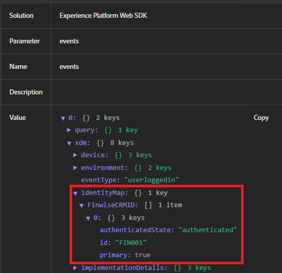

# Testa identitetsstygn

Det här exempelprogrammet simulerar ett verkligt inloggningsflöde där inloggningsuppgifterna valideras på serversidan innan CRM-ID skickas till Adobe Experience Platform (AEP). En lokal Node.js-server används för att på ett säkert sätt hantera webbsidorna, hantera grundläggande autentiseringslogik och undvika webbläsarbegränsningar (som blockerad lokal filåtkomst eller saknade CORS-huvuden) som kan störa Adobe Launch eller Web SDK-funktioner. Den här installationen ser till att upplevelsen är närmare en riktig produktionsmiljö.

## Installera node.js

Om du inte har installerat Node.js hämtar och [installerar du det härifrån](https://nodejs.org/)

Verifiera installationen genom att köra:

`node -v`

`npm -v`

## Konfigurera projektmappen

Skapa en ny katalog för exempelprogrammet med följande kommandon

`mkdir aep-demo`

`cd aep-demo`

## Initiera projektet

`npm init -y`

## Install Express (Web Server Framework)

`npm install express`

## Skapa filen server.js

```javascript
const express = require('express');
const path = require('path');
const app = express();
const PORT = 3000;

// Serve static files from the current directory
app.use(express.static(__dirname));

app.listen(PORT, () => {
  console.log(`Server is running at http://localhost:${PORT}`);
});
```

## Lägg till HTML/Assets

Kopiera alla [HTML- och CSS-filer](assets/login-app-files.zip) till den här mappen. Kopiera och klistra in AEP Tags-skriptet i avsnittet `<head>` i filen index.html.

## Kör servern

`node server.js`

## Test

Öppna `http://localhost:3000`-URL:en. Inloggningen använder alias/pass123

## Använda AEP Debugger

Adobe Experience Platform Debugger är ett kraftfullt webbläsartillägg som hjälper dig att validera data som skickas från din webbplats till Adobe Experience Platform. Det är särskilt användbart för att kontrollera om identityMap är korrekt konfigurerat och överfört via Adobe Web SDK (alloy.js).

Använd AEP Debugger när du testar inloggningshändelser, verifierar identitetssammanfogning (t.ex. att ECID och CRMID skickas) och ser till att AEP Tags-regler och Data Elements utlöses som förväntat. Den ger realtidsinsyn i utgående händelser, identitetsinformation och XDM-nyttolaster - viktigt för felsökning av profilberikning och målgruppskvalifikation.

Följande skärmbild visar att ID:t &quot;FIN001&quot; skickas korrekt.


## Steg för att verifiera identitetsinställningar i AEP

* Logga in på AEP
* Navigera till Kund -> Profiler ->Bläddra
* Sök efter FinWise CRM ID = FIN001
* Öppna profilen och titta i avsnittet Identiteter. Du ska se både CRMID och ECID.   Detta bekräftar att de två identiteterna sammanfogades i en enda profil.


