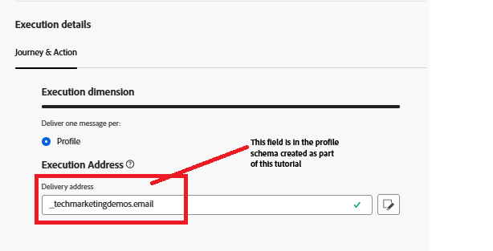

# Utlösa Adobe Journey Optimizer Journey med Adobe Web SDK

I den här utökningen av självstudiekursen om identitetskorrigering utlöses en Adobe Journey Optimizer-resa som skickar e-post till den inloggade användaren med hjälp av deras sammanslagna profil. **I den här artikeln förutsätts det att du känner till e-postkanalen och skapar innehåll för e-postkanalen.**

## Skapa konfiguration av e-postkanal

* Logga in på _**Journey Optimizer**_
* Navigera till _**Administration -> Kanaler -> Skapa kanalkonfiguration**_
* Välj **E-post** i kanallistan. Ange ett beskrivande namn och en beskrivning.
* Fyll i e-postinställningarna.
* Ange körningsinformation enligt nedan. E-postadressen skickas till profilens e-postadress som lagras i fältet
* 
* Aktivera e-postkanalskonfigurationen

## Skapa händelse

* Logga in på _**Journey Optimizer**_
* Navigera till _**Administration -> Konfigurationer**_
* Klicka på knappen Hantera på händelsekortet och klicka på Skapa händelse. Ange värdena enligt nedan
* 

* Kontrollera om händelsens eventType är lika med UserLoggedIn. I det här fallet är händelsenamnet och händelsetypen desamma för enkelhetens skull.`in(@event{event1.eventType}, ['UserLoggedIn'])`
* Spara händelsen

## Skapa resa

* Logga in på _**Journey Optimizer**_
* Navigera till _**Resehantering -> Resor -> Skapa resa**_
* Dra och släpp _**UserLoggedIn**_ -händelsen på arbetsytan
* Dra och släpp e-post från åtgärdsmenyn. Konfigurera e-poståtgärden så att den använder e-postkanalkonfigurationen som skapades tidigare
* Publicera resan

## Hur resan utlöses

Resan aktiveras när händelsenyttolasten som skickas via Web SDK matchar det som är konfigurerat under resan. I det här exemplet är händelsetypen **UserLoggedIn**

