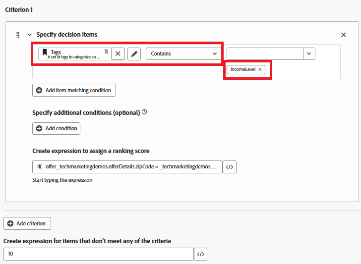

# Skapa rankningsformel

En rankningsformel i Adobe Journey Optimizer används vid offertbeslut, särskilt inom en urvalsstrategi för att fastställa prioriteringsordningen för giltiga erbjudanden. Rankningsformeln spelas upp efter att behörigheten filtrerats, när flera erbjudanden kvalificerar sig för en viss profil, men endast den (eller några) som ligger överst ska presenteras baserat på affärslogik eller profilsammanhang.

* Logga in på Journey Optimizer

* Beslut ->Strategisposition ->Rankningsformler ->Skapa formel

Rankningsformel


Ett kriterium i en rankningsformel refererar till en villkorsregel som används för att tilldela en poäng till ett erbjudande. Dessa kriterier jämför attribut från erbjudandet och profilen eller sammanhanget för att avgöra hur relevant ett erbjudande är för en viss individ.


Kriterium 1

Det här villkoret filtrerar beslutsobjekt (erbjudanden) **så att endast** erbjudanden som är taggade med IncomeLevel inkluderas.
Dessa filtrerade erbjudanden fortsätter sedan till nästa steg - till exempel rankning eller leverans - baserat på den ytterligare logik du definierar.



Följande uttryck används för att skapa rankningspoängen

```pql
if(   offer._techmarketingdemos.offerDetails.zipCode = _techmarketingdemos.zipCode,   _techmarketingdemos.annualIncome / 1000 + 10000,   if(     not offer._techmarketingdemos.offerDetails.zipCode,     _techmarketingdemos.annualIncome / 1000,     -9999   ) )
```

Vad formeln gör

* Om erbjudandet har samma ZIP-kod som användaren ger det ett mycket högt poäng så att det plockas först.

* Om erbjudandet inte innehåller någon postnummer alls (det är ett allmänt erbjudande), ger du det en normal poäng baserad på användarens intäkter.

* Om erbjudandet har en annan ZIP-kod än användaren kan du ge det en mycket låg poäng så att det inte väljs.

På det här sättet kan systemet

* Försöker alltid visa ett ZIP-matchande erbjudande först,

* Fallar tillbaka till ett allmänt erbjudande om ingen matchning hittas och undviker att visa erbjudanden som är avsedda för andra ZIP-koder.


Om ett erbjudandeobjekt inte uppfyller något av filtervillkoren (som att inte ha taggen &quot;IncomeLevel&quot;) får erbjudandet standardpoängen 10.


